关键词：Mapbox、GeoServer、Tomcat、PostgreSQL、PostGis
## 一、地图数据获取

使用OpenStreetMap获取中国的矢量地图数据
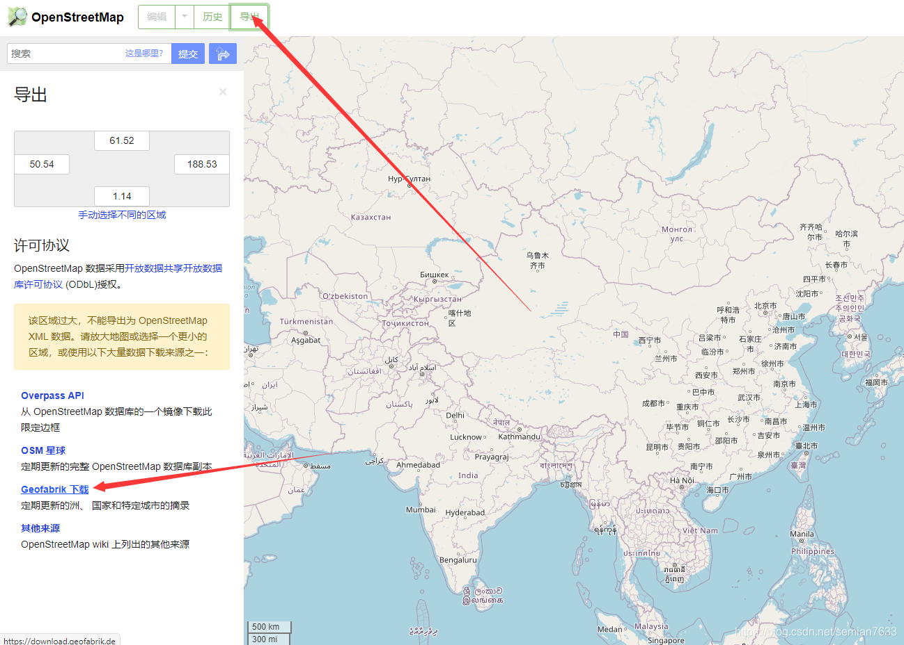
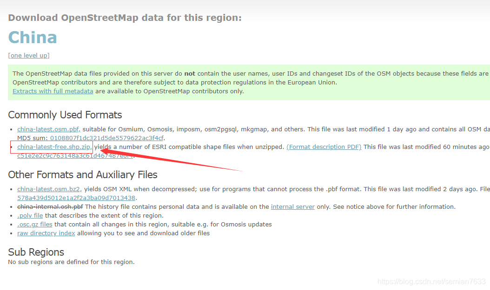
## 二、安装GeoServer及Vector Tiles扩展
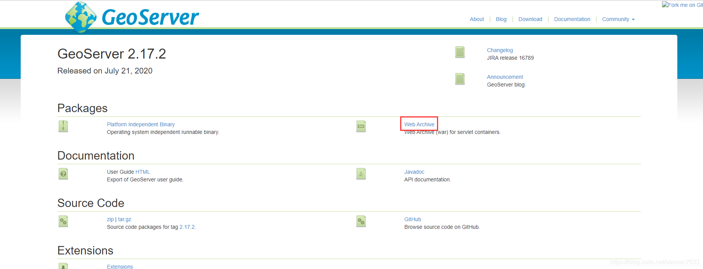
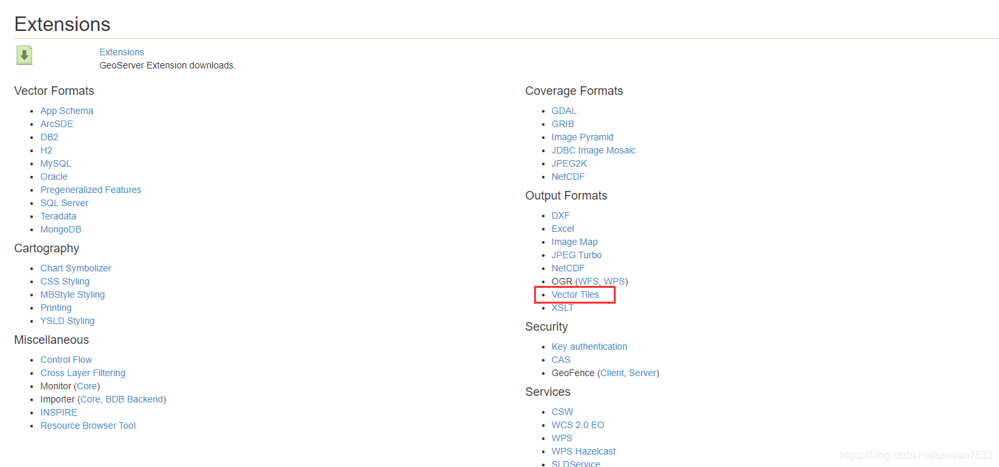
**将下载好的GeoServer.war放入Tomcat，启动Tomcat后将Vector Tiles扩展中的四个jar包放入GeoServer的lib目录并重启Tomcat。**

## 三、安装PostgreSQL及PostGis扩展
略
## 四、将shp文件导入PostgreSQL
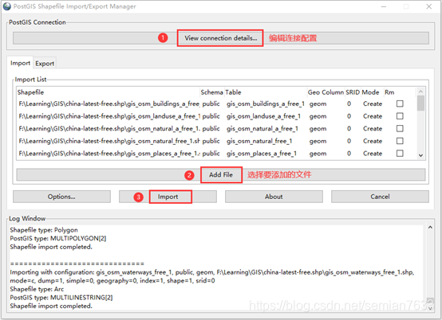
**SRID那一列选择4326**

## 五、创建工作区、数据存储
打开GeoServer的web页面，默认用户名admin，密码geoserver
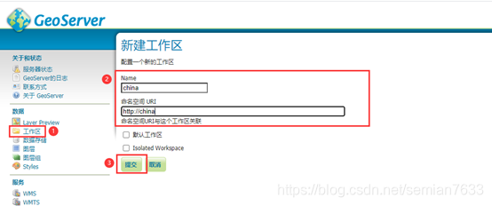
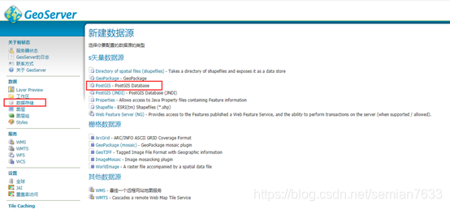
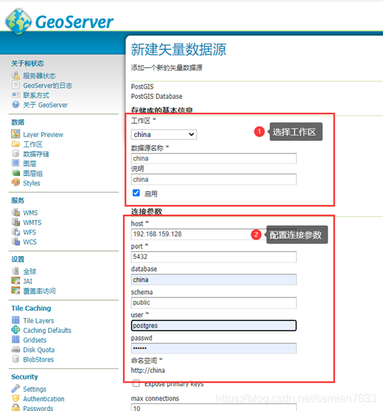

## 六、发布图层、创建图层组
1. 发布图层
   
2. 发布图层时，“定义SRS”位置选择“EPSG:4326”
   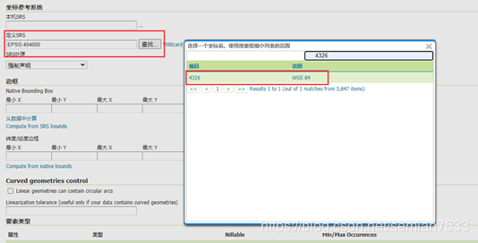
   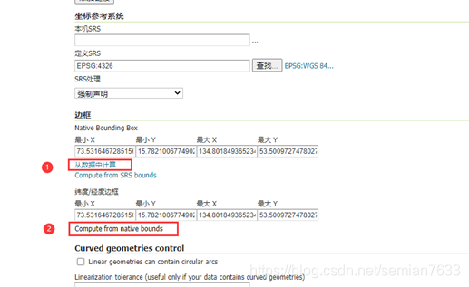
2. 创建图层组
   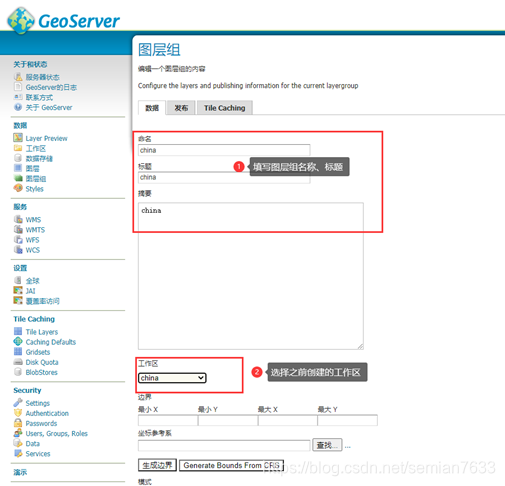
   添加图层并生成边界
   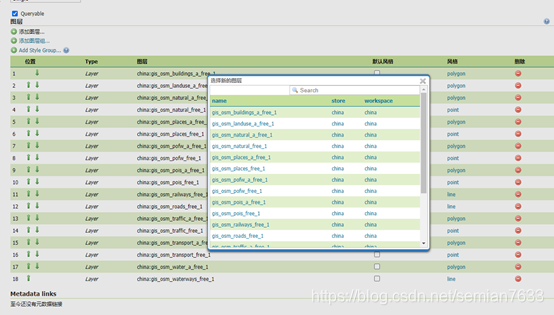
   添加完所需图层后生成边界
   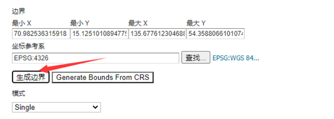

## 七、设置矢量切片格式
勾选application/x-protobuf;type=mapbox-vector矢量切片格式，切片为.dbf格式的文件，压缩率更好。适合网络传输。选择默认切片格式EPSG:900913，因为Mapbox只支持WGS84 Web 墨卡托投影投影
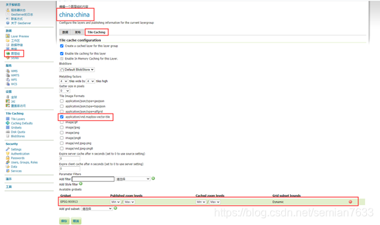
若此处无“application/x-protobuf;type=mapbox-vector“选项，请先添加Vector Tiles扩展。
## 八、离线部署Mapbox所需的字体、图标等
[离线部署Mapbox之.pbf字体库](https://www.cnblogs.com/ATtuing/p/9217029.html)

[离线部署Mapbox之sprite大图图标文件生成](https://www.cnblogs.com/ATtuing/p/9273391.html)

## 九、Mapbox获取地图
1. 点击左上角GeoServer图标回到首页，点击右侧tms
   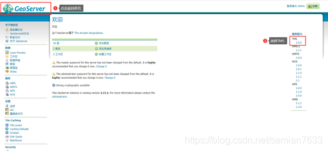
2. 复制tms服务路径
   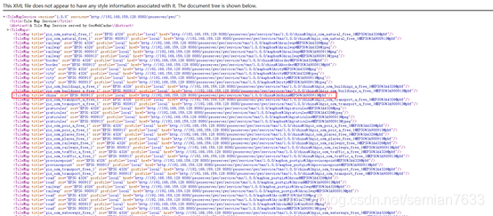
3. Mapbox自定义样式中填入tms地址，定义好样式就可以了
   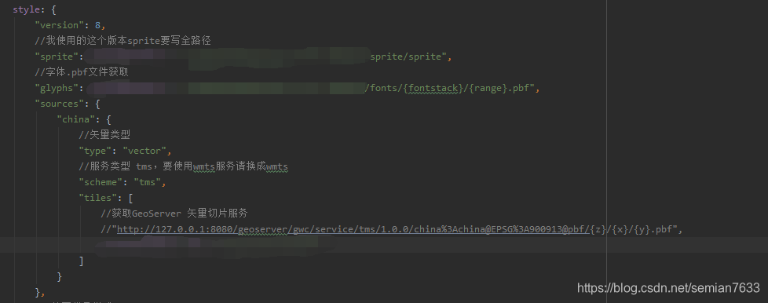

参考：[ATtuing的博客](https://www.cnblogs.com/ATtuing/)
